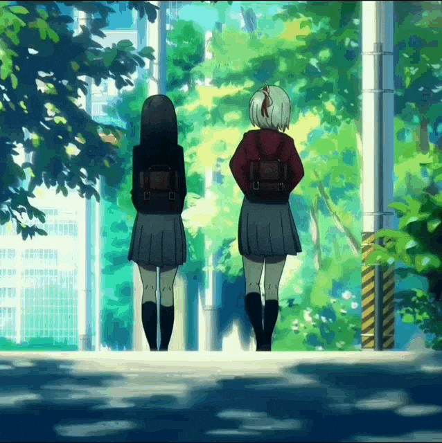
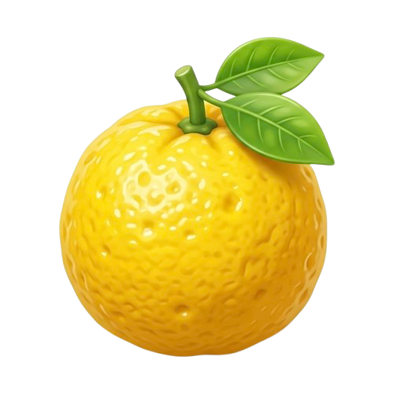

<!-- Greeting -->
<h1>Welcome to my profile </h1>

<!-- Banner GIF -->

<!-- Typing quote -->

  

<!-- Featured project divider -->

<!-- Featured Projects -->
<table width="100%">
  <tr>
    <td width="80" align="center">
      
    </td>
    <td align="left">
      <a href="https://github.com/ntw-cts/yuzu"><strong>YUZU</strong></a>
      &nbsp;—&nbsp; Premium Anime Streaming Web App 
      
A clean, minimal anime streaming platform. Browse by season, track your watchlist, and stream your favorites — all in one place.

      
      
      
    </td>
  </tr>
  <tr>
    <td width="80" align="center">
      
    </td>
    <td align="left">
      <a href="https://github.com/ntw-cts/Spotify-Romaji-Lyrics"><strong>Spotify-Romaji-Lyrics</strong></a>
      &nbsp;—&nbsp; Browser Extension 
      
Automatically detects Japanese lyrics on Spotify and injects Romaji subtitles directly underneath each line.

      
      
    </td>
  </tr>
</table>

 

<!-- Skills divider -->

 

<!-- Skill icons -->

  

<!-- Anime section divider -->

<!-- Anime cards (untouched!) -->

